# 每日一語 語出驚人
 Android實作與開發（日文教學App) 
 
 呂紹宇 
 呂國銘 
 蔡立中 
 黎子歆 
 劉鎮逢

##緒論

* 開發動機
* 開發目的
* 使用對象

##開發動機

* 目前使用智慧型手機的使用人數非常多，而智慧型手機的使用者一定會下載App
* 為數眾多的App中又以社交、遊戲下載的使用者為大宗
* 市場上有許多教學應用的App，不過好用的幾乎都要付費
* 部分語言教學App的崛起

##開發目的

* 讓想學習日文的使用者可以隨時透過智慧型手機進行學習
* 使用都是基本常見的詞彙讓使用者學習沒有太大的障礙
* 不用額外花費也可以達到學習效果
* 使用者對於日文這方面會有基礎的認知

##使用對象

<ol>
<ui>分為下列三個族群:</ui>
<li>學生族群         (日文的遊戲、動漫 )
<li>在職人士         (工作上可能會需要) </li>
<li>中老年人          (在家閒暇時學習更多知識)</li>
</ol> 

##使用對象
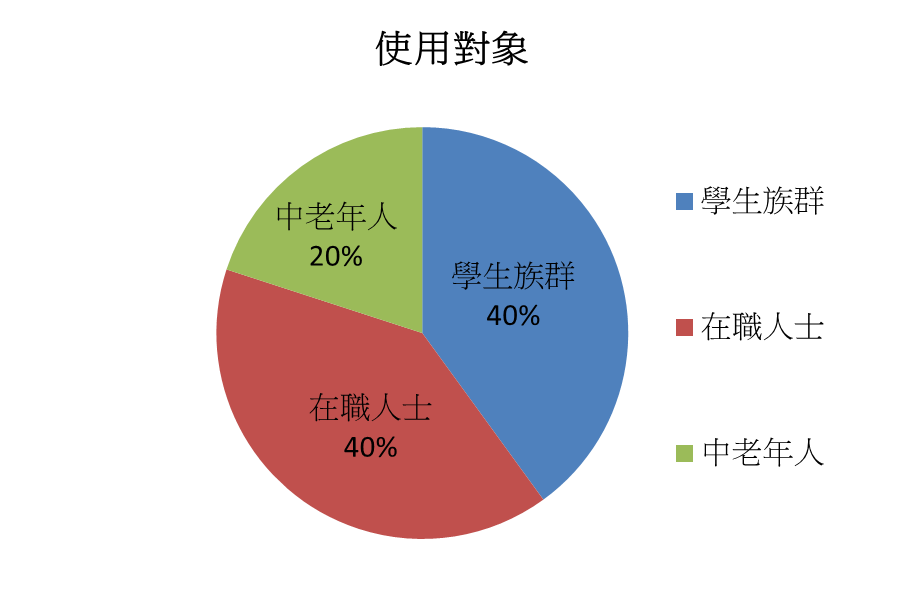

##使用對象 (Markdown 語法)

##文獻探討 Android簡介 

* Android是一個以Linux為基礎的半開放原始碼作業系統，最早主要系統最用於行動設備上
* Google與84家硬體製造商、軟體開發商及電信營運商成立開放手持設備聯盟來共同研發改良Android系統
* Google發布了Android的原始碼。讓生產商推出搭載Android的智慧型手機，之後Android作業系統後來更逐漸拓展到平板電腦和其他領域(筆電、電子書)上

##文獻探討

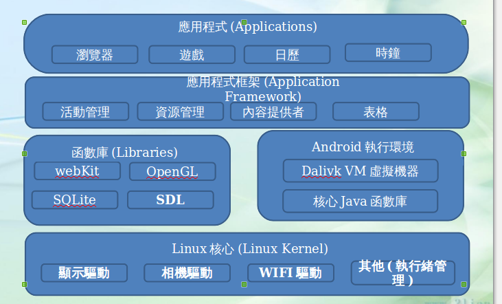

##文獻探討

日文教學相關app
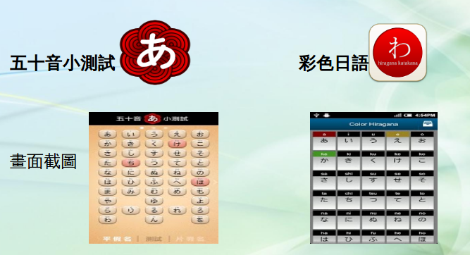

##文獻探討

相關app比較 
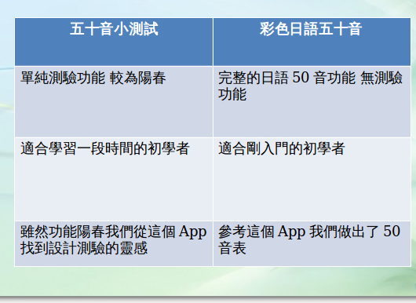

##製作設計

系統架構 
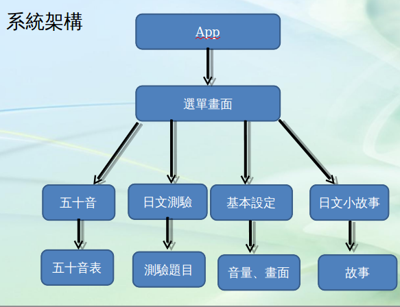

##製作設計

開發環境 
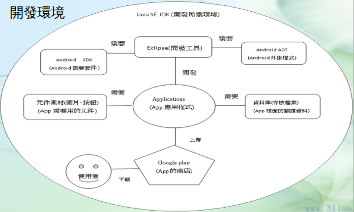

##製作設計

###系統簡介

* 主要以學習日文為重點，以五十音為基本的功能，真人發音的方式讓使用者在學習方面比較不會產生障礙。
* 有了五十音的基礎就可以使用我們的小測驗，測驗分為三個階級分別為:初階、中階、高階，可以試驗自己學習的成效到哪。
* 我們還設計了一些日文的簡單故事，讓使用者可以在閱讀故事時學習日文。

##製作設計

###相關技術

* 日文50音的基礎認知、發音
* 日語基本詞彙
* Java 物件導向程式語言
* XML可延伸標記式語言
* Android語言 (包含 Java函示庫、XML語法)

##製作結果

系統介面 
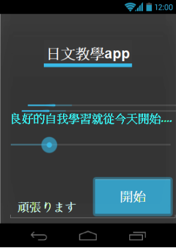

##製作結果

功能選單主要把功能分為四大項目 
<table>
    
1.五十音
                2.日文測驗
                3.基本設定
                4.日語小故事

     
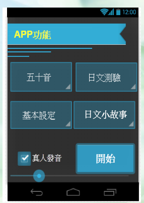
    
</table>

##製作結果

五十音教學 
 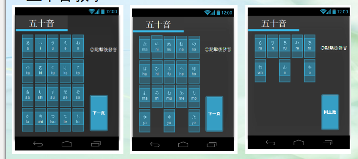

##製作結果

日文測驗 這是初階的介面
主要針對剛使用的初學者

##製作結果

日文測驗 
這是中階的介面
主要是針對50音有一定程度
的使用者
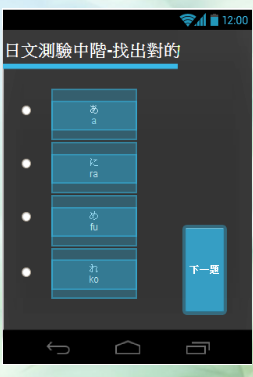

##製作結果

日文測驗 
這是高階的介面
對於50音可以倒背如流
且日文程度有一定自信的使用者 
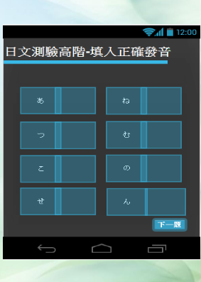

##製作結果

系統基本設定 
一些基本的發音,畫面的設定
 
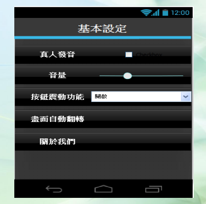

##製作結果

日文小故事 

這是我們日文故事的介面 
上面是圖片
下面則是有中文跟日文的字幕 
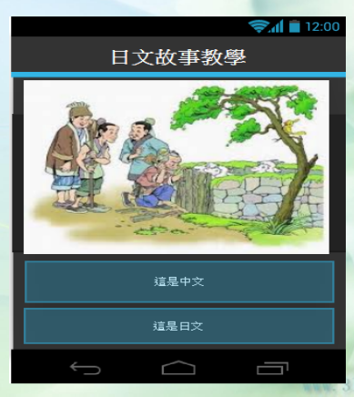

##結論

我們的App能夠給剛學習日文的使用者一個比
較容易學習的環境，並且有語音及故事來加深
印象，讓使用者學習起來不單單只是死背50音
或是一些生硬的詞彙，而是使用一些簡單的、
基本的詞彙讓使用者感覺到學習日文其實並不
難，只要有心從基礎學起一定可以學會的。

##參考文獻

* Android 簡介   維基百科: http://zh.wikipedia.org/wiki/Android
* 架構圖   Android相關書籍 (javaSE7&android 程式範例教本 碁峯資訊)
* Android 相關教學 http://www.gururu.tw/
* 日文相關資料 http://smady.com/
* Android相關書籍  (Android 初學特訓班 碁峯資訊)  
* Android相關書籍  (Android 4.x App開發教戰手冊  碁峯資訊)

##工作進度

##工作分配

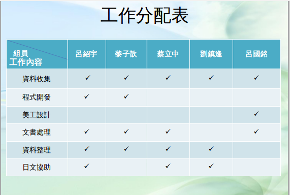
